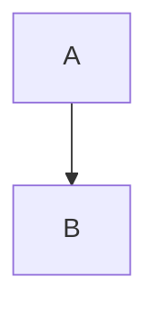
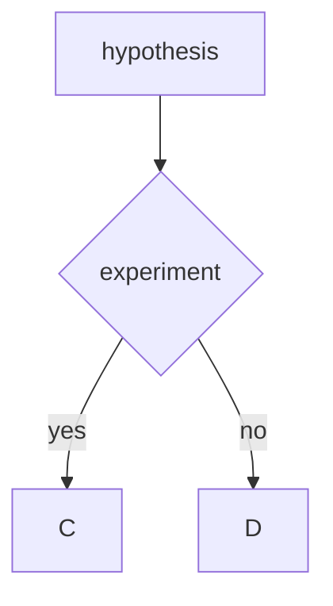

# 11  (#this sign means the title)
Markdown can use in different software
use the basic function the 
https://ko.wikipedia.org/wiki/%EB%A7%88%ED%81%AC%EB%8B%A4%EC%9A%B4 the link to tell us how to use the markdown function.
## Room 205
---------

## the courses
##search the information foe markdown in python
markdown can use the ppt
```python
  def():
   return
```




Use the markdown to refine the ppt
